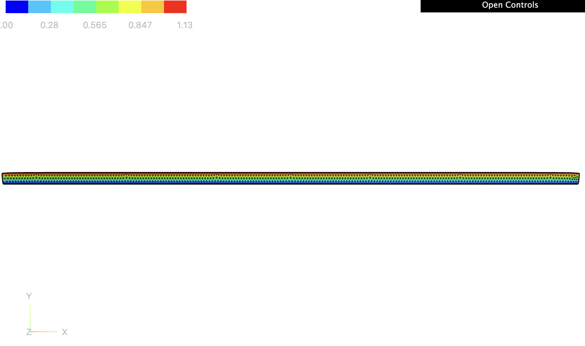
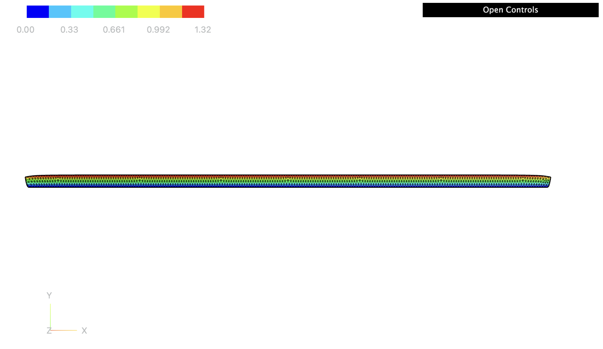
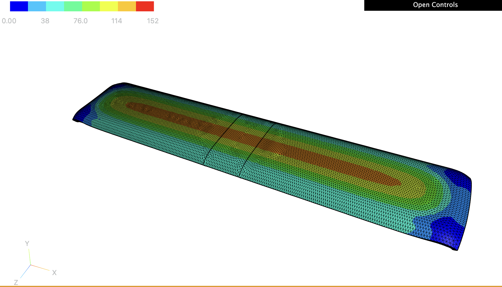
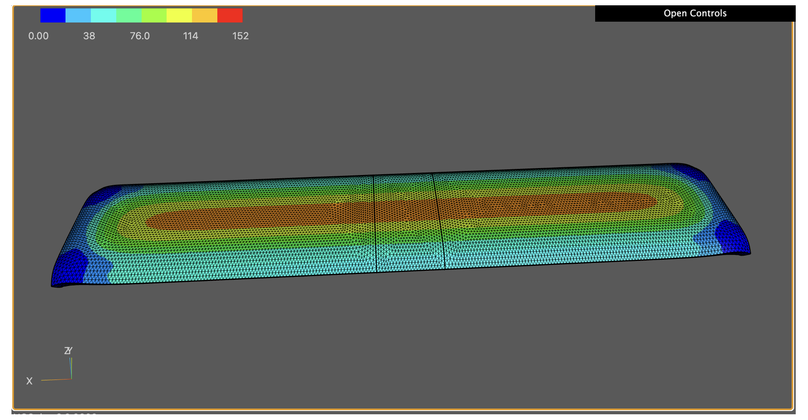

# Pedro Hernández-Llanos, Ph.D.

Welcome to my GitHub profile! I am a pure and applied mathematician whose research focuses on the interaction of the **Calculus of Variations**, **Partial Differential Equations (PDEs)**, and solid mechanics, with applications to Materials Science and Continuum Mechanics. The use of variational methods is a common theme throughout my work. Specifically, I specialize in the **Homogenization** of problems arising in the context of PDEs with **Thin structures** and **Multistructures**. I am interested in developing new theories for **simultaneous homogenization and dimension reduction** (multiscale convergence, $\Gamma$-convergence, and the periodic unfolding method) by combining variational techniques, operator theory, and geometric measure theory. These theories find direct applications in Mechanical and Electrical Engineering, as well as Fluid Flow, to name a few.

I am currently a **Guest Postdoctoral Researcher** working with Prof. Sebastian Throm in the Mathematical Modelling and Analysis Group within the Department of Mathematics and Mathematical Statistics at **Umeå University**, Sweden.

---

## 🔬 Research Interests

My research addresses the development of new theories for simultaneous homogenization and dimension reduction (multiscale convergence, $\Gamma$-convergence, and the periodic unfolding method) using techniques from the calculus of variations, operator theory, and geometric measure theory. These theories have direct applications in:

* Solid Mechanics and Materials Science.
* Mechanical, Electrical Engineering, and Fluid Flow.
* Nonlinear elasticity models, poroelastic plates, magnetoelastic structures, and junctions of ferroelectric materials.

---

## 🎓 Education

* **Ph.D. in Mathematics** | *Universidad de Concepción, Chile* (2015 – 2020)
  * **Thesis:** *Variational limits of problems in junction domains for Ferroelectric and Hyperelastic materials by reduction of dimension*
  * **Supervisors:** Prof. Rajesh Mahadevan, Prof. Ravi Prakash, Prof. Antonio Gaudiello, and Prof. Luciano Carbone.
  * **Funding:** National Agency for Research and Development of Chile (ANID), Doctoral Fellowship.
  * **Honors:** Grade 4.7/5.0 (1st in thesis, 2nd overall).

* **M.Sc. in Mathematical Sciences** | *Universidad del Atlántico, Colombia* (2011 – 2014)
  * **Thesis:** *On new families of generalized Apostol-type polynomials and their properties*
  * **Supervisor:** Prof. Alejandro Urieles Guerrero.

* **Bachelor’s Degree in High School Education (Major in Mathematics)** | *Universidad del Atlántico, Colombia* (2005 – 2010)
  * **Honors:** Grade 4.34/5.0 (1st overall).
  * **Awards:** Undergraduate prize for best student of promotion with M.Sc. Fellowship.

---

## 💼 Academic Trajectory and Projects

* **Guest Postdoctoral Researcher** | *Umeå University, Sweden* (2026 – Present).
  * Research on the derivation of the amplitude equation for the space-fractional Swift-Hohenberg equation via evolutionary $\Gamma$-convergence alongside Prof. Sebastian Throm.

* **Postdoctoral Researcher** | *Universidad de O'Higgins (UOH), Chile* (2023 – 2026).
  * Principal Investigator of the project **Fondecyt Postdoctoral ANID N° 3230202**, focused on two-dimensional models of thin structures with magnetoelasticity, poroelasticity, and rigid gel properties alongside Prof. Duvan Henao.

* **Postdoctoral Research Associate** | *University of Zagreb, Croatia* (2021 – 2022).
  * Project funded by the Croatian Science Foundation (HRZZ) centered on poroelastic plates via simultaneous homogenization and dimension reduction alongside Prof. Igor Velčić.

---

## 🛠️ Scientific Computing and Tools

I have experience developing scientific code applied to solving and simulating PDEs, variational methods, and dimensional reduction problems:

* **Languages and Software:** Advanced in Python, FreeFem++, Matlab, Julia, R, Mathematica, and Wolfram Language.
* **Scientific Typography:** Professional editing and typesetting in LaTeX and TeX.

---

## 📝 Selected Publications

### Peer-Reviewed Journals

* **M. Bužančić, P. Hernández-Llanos, I. Velčić, & J. Žubrinić** (2026). *Poroelastic plate model obtained by simultaneous homogenization and dimension reduction*. **Journal of Evolution Equations**, 26:12, 1-88. [DOI: 10.1007/s00028-025-01152-z](https://doi.org/10.1007/s00028-025-01152-z).
* **L. Carrero & P. Hernández-Llanos** (2026). *Kirchhoff-type equations involving the fractional (p, q)-laplacian*. **Journal of Mathematical Analysis and Applications**, 558, 130449, 1-15. [DOI: 10.1016/j.jmaa.2026.130449](https://doi.org/10.1016/j.jmaa.2026.130449).
* **T. Durante, L. Faella, P. Hernández-Llanos, & R. Prakash** (2025). *A homogenized bending shell theory for multiscale materials from 3D nonlinear elasticity*. **Journal of Elasticity**. [DOI: 10.1007/s10659-025-10154-4](https://doi.org/10.1007/s10659-025-10154-4).
* **P. Hernández-Llanos** (2022). *Asymptotic analysis of a junction of hyperelastic rods*. **Asymptotic Analysis**, 126(3-4), 303-322. [DOI: 10.3233/ASY-211683](https://doi.org/10.3233/ASY-211683).
* **L. Carbone, A. Gaudiello, & P. Hernández-Llanos** (2020). *T-junction of ferroelectric wires*. **ESAIM: Mathematical Modelling and Numerical Analysis (ESAIM: M2AN)**, 54(5), 1429-1463. [DOI: 10.1051/m2an/20200001](https://doi.org/10.1051/m2an/20200001).
* **P. Hernández-Llanos, Y. Quintana, & A. Urieles** (2015). *About extensions of generalized apostol-type polynomials*. **Results in Mathematics**, 68, 203-225. [DOI: 10.1007/s00025-014-0430-2](https://doi.org/10.1007/s00025-014-0430-2).

### Under Review / Preprints

* **D. Henao, P. Hernández-Llanos, C. Roman, & X. Lamy** (2026). *Stability surface for confined hydrogel layer on substrates*. (To be submitted). [PDF Paper](https://pedrohernandez-jpg.github.io/Paper1version2026.pdf).
* *Junction of ferroelectric thin cylinders* (with L. Faella and R. Prakash) – Submitted to **ESAIM: COCV**. [arXiv:2311.00515](https://doi.org/10.48550/arXiv.2311.00515).
* *Homogenized moderately wrinkled shell theory from 3d koiter's linear elasticity* (with R. Mahadevan and R. Prakash) – Submitted to **Journal of Elasticity**. [arXiv:2601.11384](https://arxiv.org/abs/2601.11384).

---

## 💻 Codes

Selected numerical simulations developed to solve and validate the variational and PDE models arising in my research, implemented in Python/FEniCS.

**`GelStableConfiguration.py`** — Finite-element computation of stable equilibrium configurations of a confined hydrogel layer bonded to a rigid substrate, solved via an incremental softening (continuation) scheme with Newton's method under a penalty-based non-penetration constraint.

<table>
<tr>
<td width="50%">

**Stable Configuration — μ̄ = -0.0005**

Successful computation of the stable configuration for the gel for L = 90.00 mm, d = 1.62 mm, φ₀ = 0.20 and μ̄ = -0.0005 under zero-displacement Dirichlet boundary conditions (**u** = **0**) along the bonded and debonded interfaces, supplemented by a penalty-based non-penetration condition (y + u_y ≥ 0) at the bottom surface. The nonlinear problem is solved via an incremental softening scheme across 16 load steps. Newton's method is executed with a convergence tolerance of tol = 10⁻³ (and tol = 10⁻⁶ for the final step), allowing a maximum of 100 Newton iterations per step and up to 500 iterations for the final stage. The color bar is adjusted to show in red the magnitude of the maximum displacement, which is 1.13 mm. This corresponds to the solution obtained when using the swelling equilibrium of the gel with a shear modulus of 0.1372 MPa as the initial approximation for a gel with shear modulus of 0.13721349978333722 MPa.

</td>
<td width="50%">

**Stable Configuration — μ̄ = -0.003**

Successful computation of the stable configuration for the gel for L = 90.00 mm, d = 1.62 mm, φ₀ = 0.20 and μ̄ = -0.003 under zero-displacement Dirichlet boundary conditions (**u** = **0**) along the bonded and debonded interfaces, supplemented by a penalty-based non-penetration condition (y + u_y ≥ 0) at the bottom surface. The nonlinear problem is solved via an incremental softening scheme across 16 load steps. Newton's method is executed with a convergence tolerance of tol = 10⁻³ (and tol = 10⁻⁶ for the final step), allowing a maximum of 100 Newton iterations per step and up to 500 iterations for the final stage. The color bar is adjusted to show in red the magnitude of the maximum displacement, which is 1.32 mm. This corresponds to the solution obtained when using the swelling equilibrium of the gel with a shear modulus of 0.1372 MPa as the initial approximation for a gel with shear modulus of 0.13721349978333722 MPa.

</td>
</tr>
</table>

**`gels-testCluster-NoChemicalPotential.py`** — Finite-element computation of the energy density of a confined hydrogel layer bonded to a rigid substrate, solved via an incremental softening (continuation) scheme with Newton's method under a penalty-based non-penetration constraint.

<table>
<tr>
<td width="50%">

**Stable Configuration — μ̄ = 0.00**

Successful computation of the energy density for a gel for L = 90.00 mm, d = 1.62 mm, w =15.00 mm φ₀ = 0.20 and μ̄ = -0.0005 under zero-displacement Dirichlet boundary conditions (**u** = **0**) along the bonded and debonded interfaces, supplemented by a penalty-based non-penetration condition (y + u_y ≥ 0) at the bottom surface. The nonlinear problem is solved via an incremental softening scheme across 16 load steps. Newton's method is executed with a convergence tolerance of tol = 10⁻³ (and tol = 10⁻⁶ for the final step), allowing a maximum of 100 Newton iterations per step and up to 500 iterations for the final stage. The color bar is adjusted to show in red the magnitude of the maximum density energy, which is 152 mJ. 

</td>
<td width="50%">

**Stable Configuration — μ̄ = -0.00**

Successful computation of the energy density for a gel for L = 90.00 mm, d = 1.62 mm, w =15.00 mm φ₀ = 0.20 and μ̄ = -0.0005 under zero-displacement Dirichlet boundary conditions (**u** = **0**) along the bonded and debonded interfaces, supplemented by a penalty-based non-penetration condition (y + u_y ≥ 0) at the bottom surface. The nonlinear problem is solved via an incremental softening scheme across 16 load steps. Newton's method is executed with a convergence tolerance of tol = 10⁻³ (and tol = 10⁻⁶ for the final step), allowing a maximum of 100 Newton iterations per step and up to 500 iterations for the final stage. The color bar is adjusted to show in red the magnitude of the maximum density energy, which is 152 mJ.

</td>
</tr>
</table>

**`DarcyPrimal2d.edp`** — Purpose of the code: Numerical verification of the finite element approximation for a two-dimensional Darcy problem in primal formulation. The code solves the problem using continuous piecewise-linear ($P_1$) finite elements, compares the numerical solution with the exact analytical solution, and evaluates the $H^1$-error and convergence rate under successive mesh refinements.

<table>
<tr>
<td width="50%">
<video src="DarcyPrimal2d_exact.mp4" width="100%" autoplay loop muted playsinline controls></video>

**Exact solution**

Analytical pressure field $p(x,y)=\cos(\pi x)\sin(\pi y),$ used as the reference solution for the two-dimensional Darcy problem.

</td>
<td width="50%">
<video src="DarcyPrimal2d_approx.mp4" width="100%" autoplay loop muted playsinline controls></video>

**Approximate solution**

Finite element approximation of the pressure field obtained using continuous piecewise-linear ($P_1$) finite elements on a triangular mesh.

</td>
</tr>
</table>

**`DarcyPrimal3d.edp`** — Purpose of the code: Numerical verification of the finite element approximation for a three-dimensional Darcy problem in primal formulation. The code solves the problem using continuous piecewise-linear ($P_1$) finite elements on a tetrahedral mesh, compares the numerical solution with the exact analytical solution, and evaluates the $H^1$-error and convergence rate under successive mesh refinements.

<table>
<tr>
<td width="50%">
<video src="Darcy-3D-primal_exact.mp4" width="100%" autoplay loop muted playsinline controls></video>

**Exact solution**

Analytical pressure field $p(x,y,z)=\cos(\pi x)\sin(\pi y)e^z,$ used as the reference solution for the three-dimensional Darcy problem.

</td>
<td width="50%">
<video src="Darcy-3D-primal_approx.mp4" width="100%" autoplay loop muted playsinline controls></video>

**Approximate solution**

Finite element approximation of the pressure field obtained using continuous piecewise-linear ($P_1$) finite elements on a tetrahedral mesh of the three-dimensional domain.

</td>
</tr>
</table>

**`DarcyMixed2d.edp`** — Purpose of the code: Numerical verification of the mixed finite element approximation for a two-dimensional Darcy problem. The code simultaneously computes the Darcy flux and pressure using the Raviart–Thomas $RT_0$ finite element space for the flux and the piecewise-constant $P_0$ space for the pressure. The numerical solution is compared with the exact solution, and the errors and convergence rates are evaluated in the $H(\mathrm{div})$ norm for the flux and the $L^2$ norm for the pressure.

<table>
<tr>
<td width="50%">
<video src="Darcy-mixto_exact_u.mp4" width="100%" autoplay loop muted playsinline controls></video>

**Exact solution**

Analytical flux field

$$\mathbf{u}(x,y)=\left[\frac{\pi}{D}\sin(\pi x)\sin(\pi y),\ -\frac{\pi}{D}\cos(\pi x)\cos(\pi y)\right],$$

with pressure field $p(x,y)=\cos(\pi x)\sin(\pi y)$, used as reference solutions for the mixed Darcy problem.

</td>
<td width="50%">
<video src="Darcy-mixto_aprox_uh.mp4" width="100%" autoplay loop muted playsinline controls></video>

**Approximate solution**

Mixed finite element approximation of the Darcy flux and pressure, using the Raviart–Thomas $RT_0$ finite element space for the flux and the piecewise-constant $P_0$ finite element space for the pressure.

</td>
</tr>
</table>

---

## 🎓 Teaching and Supervision

I have lectured and led seminars at several international institutions:

* **Universidad de O'Higgins (Chile):** Introduction to Discrete Mathematics (ING1111), Linear Algebra (ING1102). Organizer of the *Calculus of Variations & PDE Seminar*.
* **Universidad de Concepción (Chile):** Real Analysis I, Calculus I and II, Introduction to University Mathematics.
* **Universidad del Atlántico (Colombia):** Differential Calculus, Foundations of Mathematics, Short courses on Orthogonal Polynomials.
* **Supervision:** Active co-supervision of Ph.D. students (UOH), Master's, and undergraduate students (U. del Atlántico).

---

## 🌐 Scientific Identifiers and Contact

* 📧 **Email:** [phernandezllanos@gmail.com](mailto:phernandezllanos@gmail.com)
* 💼 **LinkedIn:** [Pedro Hernández-Llanos](https://www.linkedin.com/in/pedro-hernandez-llanos-254124160/)
* 🔬 **ResearchGate:** [ResearchGate Profile](https://www.researchgate.net/profile/Pedro-Hernandez-Llanos)
* 📝 **zbMATH Open:** [zbMATH Publications](https://zbmath.org/authors/?q=Pedro+Hernandez-Llanos)
* 🆔 **ORCID:** [0000-0001-5017-2108](https://orcid.org/0000-0001-5017-2108)
* 🌍 **Personal Website:** [CalcVar - UOH](https://sites.google.com/view/calcvar-uoh)
