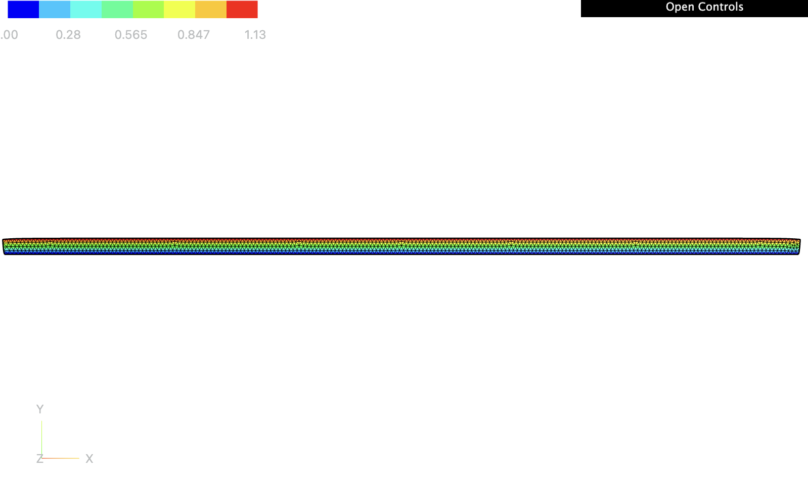
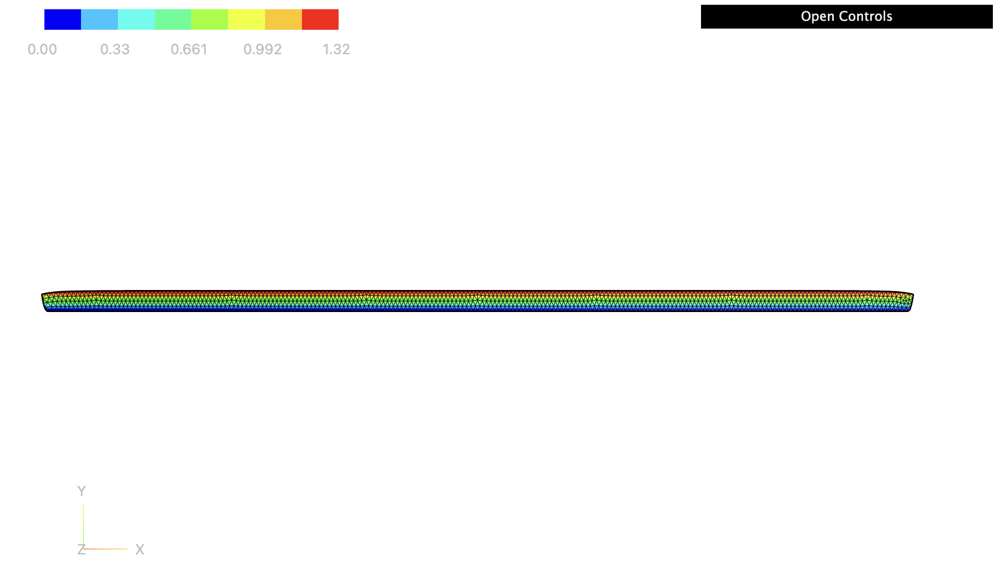
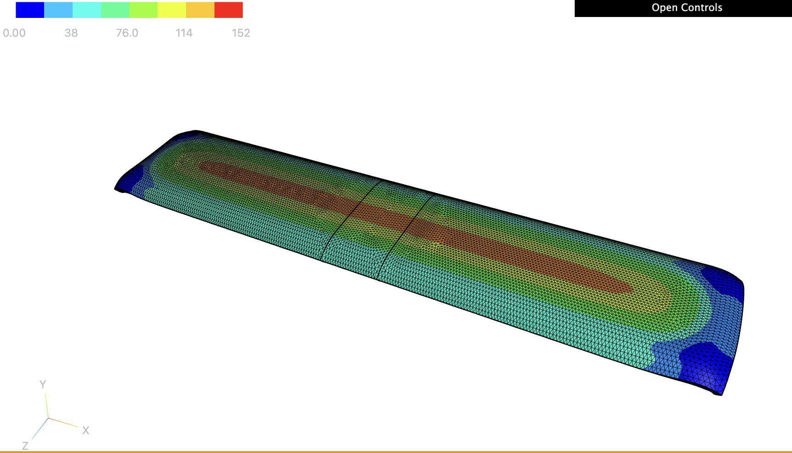
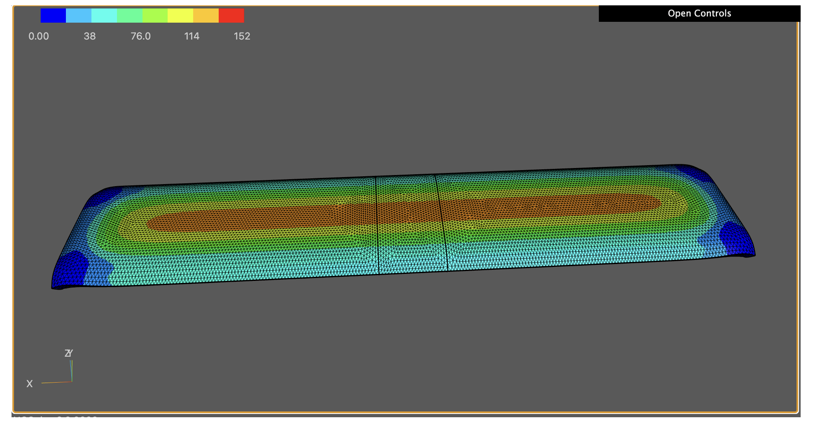
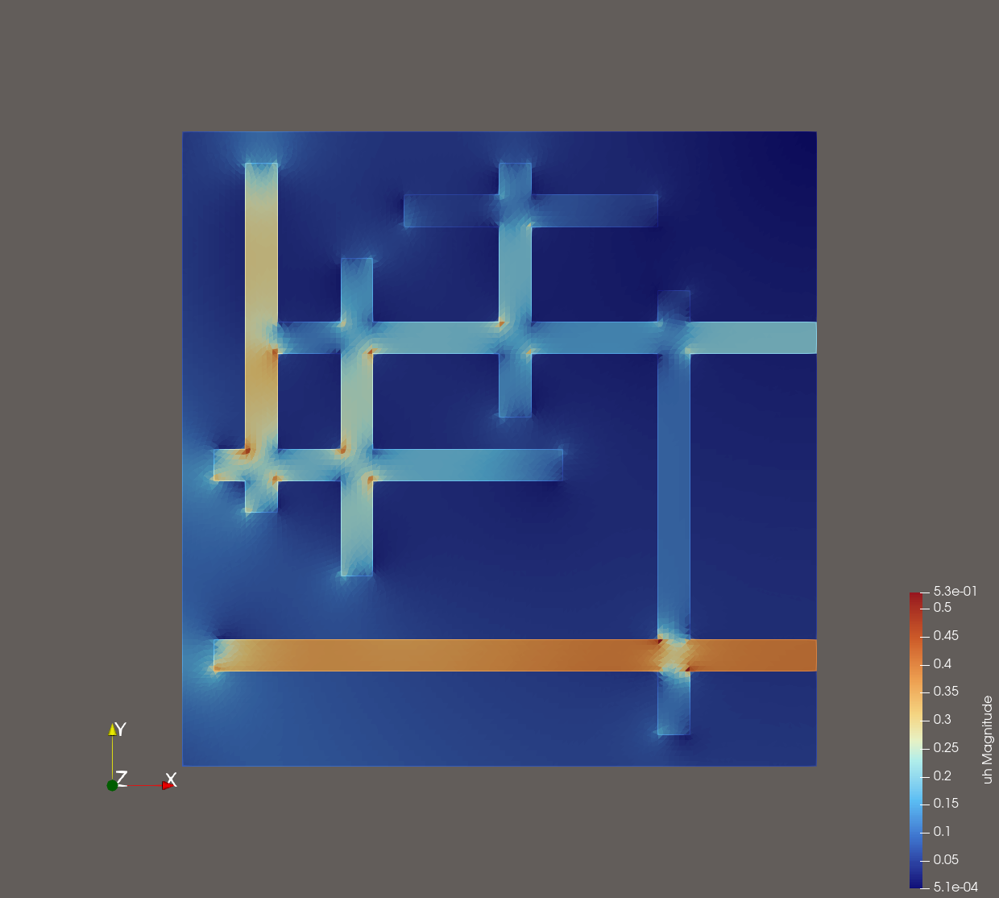
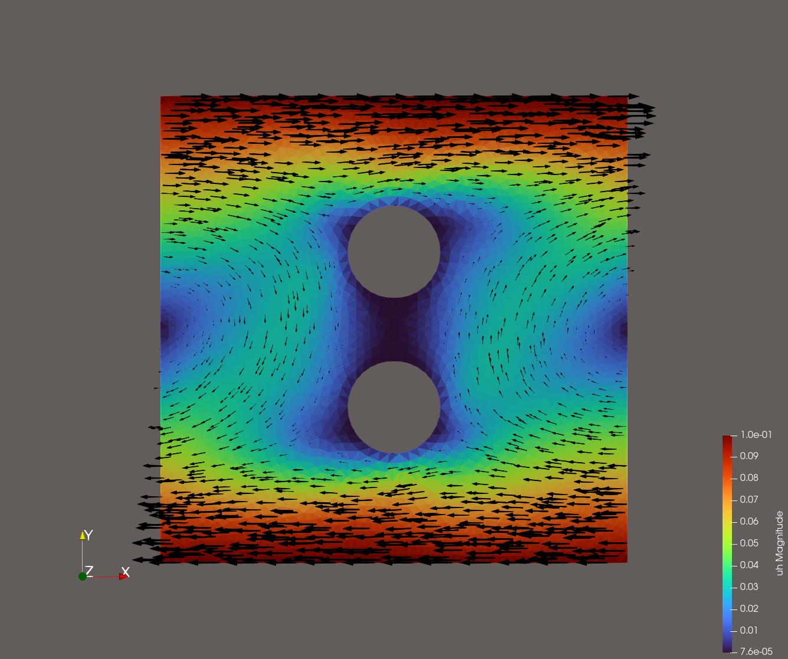

# Pedro Hernández-Llanos, Ph.D.

🌐 **Website:** [pedrohernandez-jpg.github.io](https://pedrohernandez-jpg.github.io/) &nbsp;|&nbsp; 🇪🇸 **Versión en español:** [pedrohernandez-jpg.github.io/?lang=es](https://pedrohernandez-jpg.github.io/?lang=es)

Welcome to my GitHub profile! I am a pure and applied mathematician whose research focuses on the interaction of the **Calculus of Variations**, **Partial Differential Equations (PDEs)**, and **Solid Mechanics**, with applications to **Materials Science** and **Continuum Mechanics**. The use of variational methods is a common theme throughout my work. Specifically, I specialize in the **Homogenization** of problems arising in the context of PDEs with **Thin structures** and **Multistructures**. I am interested in developing mathematical theories for the behaviour of new materials via **simultaneous homogenization and dimension reduction** using **multiscale convergence**, **$\Gamma$-convergence**, and the **periodic unfolding method** by combining variational techniques, **operator theory**, and **geometric measure theory**. These methods have direct applications in Mechanical and Electrical Engineering, as well as Fluid Flow, to name a few.

Alongside my theoretical research, I have experience in **Computational Mechanics** and **Numerical Methods for PDEs**, particularly the **Finite Element Method (FEM)**. I have worked with scientific computing tools including **Python**, **FreeFEM++**, **Matlab**, **Julia**, **R** and the finite element software **NGSolve**, applying numerical techniques to the simulation and analysis of complex physical systems. My current interests also include **computational modeling of nonlinear materials** and **soft matter systems**, where analytical and numerical approaches are combined to investigate **stability phenomena** and multiscale behavior.

<b>Guest Postdoctoral Researcher</b> at <a href="https://www.umu.se/institutionen-for-matematik-och-matematisk-statistik">Department of Mathematics and Mathematical Statistics</a> 
MIT-huset, plan 3, Matematik och matematisk statistik, Office MIT.D.326 
Umeå universitet, 901 87 Umeå, Sweden

---

## 🔬 Research Interests

* **Solid Mechanics.**
* **Materials Science.**
* **Partial Differential Equations (PDEs)** in Mechanics, Electrical Engineering, and Fluid Mechanics.
* **Calculus of Variations**, with applications to multistructures and junctions.
* **Nonlinear hyperelastic, poroelastic, magnetoelastic, and ferroelectric materials.**
* **Hydrogels and soft materials.**

---

## 🎓 Education

* **Ph.D. in Mathematics** | *Universidad de Concepción, Chile* (2015 – 2020)
  * **Thesis:** [*Variational limits of problems in junction domains for Ferroelectric and Hyperelastic materials by reduction of dimension*](https://repositorio.udec.cl/handle/11594/4668)
  * **Supervisors:** Prof. Rajesh Mahadevan, Prof. Ravi Prakash, Prof. Antonio Gaudiello, and Prof. Luciano Carbone.
  * **Funding:** National Agency for Research and Development of Chile (ANID), Doctoral Fellowship.
  * **PhD Thesis Grade:** 6.7/7.0 (Outstanding).

* **M.Sc. in Mathematical Sciences** | *Universidad del Atlántico, Colombia* (2011 – 2014)
  * **Thesis:** *On new families of generalized Apostol-type polynomials and their properties*
  * **Supervisor:** Prof. Alejandro Urieles Guerrero.

* **Bachelor’s Degree in High School Education (Major in Mathematics)** | *Universidad del Atlántico, Colombia* (2005 – 2010)
  * **Honors:** Grade 4.34/5.0 (1st overall).
  * **Awards:** Undergraduate prize for best student of promotion with M.Sc. Fellowship.

---

## 💼 Academic Trajectory and Projects

* **Guest Postdoctoral Researcher** | *Umeå University, Sweden* (2026 – Present).
  * Research on the derivation of the amplitude equation for the space-fractional Swift-Hohenberg equation via evolutionary $\Gamma$-convergence alongside Prof. Sebastian Throm.

* **Postdoctoral Researcher** | *Universidad de O'Higgins (UOH), Chile* (2023 – 2026).
  * Principal Investigator of the project **Fondecyt Postdoctoral ANID N° 3230202**, focused on two-dimensional models of thin structures with magnetoelasticity, poroelasticity, and rigid gel properties alongside Prof. Duvan Henao.

* **Postdoctoral Research Associate** | *University of Zagreb, Croatia* (2021 – 2022).
  * Project funded by the Croatian Science Foundation (HRZZ) centered on poroelastic plates via simultaneous homogenization and dimension reduction alongside Prof. Igor Velčić.

---

## 🏆 Grants as Principal Investigator (PI) and Awards

* **2025** | *Umeå Universitet — Horizon Europe Marie Skłodowska-Curie Actions.*
  Call HORIZON-MSCA-2025-PF-01-01, MSCA Postdoctoral Fellowships 2025. Project proposal 101274133-VAMOS. Total score: 86.4% (threshold: 70/100). **Seal of Excellence.**
* **15/04/2023 – 14/04/2026** | *National Agency for Research and Development of Chile (ANID) — Fondecyt Postdoctoral Fellowship 2023.*
  Grant No. 3230202. Awarded on the basis of academic merit. Valued at 30,000 USD per annum.
* **20/06/2025 – 19/07/2025** | *Instituto de Ciencias Matemáticas (ICMAT), Universidad Autónoma de Madrid, Spain.*
  Grant "Puentes Matemáticos con Latinoamérica" 2025. Awarded on the basis of academic merit. Valued at 1,100 USD per month.
* **02/10/2021 – 30/09/2022** | *Croatian Science Foundation (HRZZ).*
  "Homogenization and dimension reduction and Structural Optimization in continuum mechanics". Awarded as Associate Postdoctoral Fellow at the Faculty of Electrical Engineering and Computing (FER), University of Zagreb, on the basis of academic merit. Valued at 1,800 USD per month.
* **2015 – 2020** | *National Agency for Research and Development of Chile (ANID) — Fondecyt National Doctoral Fellowship 2015.*
  Grant No. 21150001. Awarded on the basis of academic merit. Valued at 12,065 USD per annum.
* **2015** | *Universidad del Atlántico, Colombia — Impacto Caribe Project.*
  "About generalized Apostol-type polynomials", number IC-002627-2015. Awarded on the basis of academic merit. Valued at 60,000,000 COP per annum.
* **2014** | *Universidad del Atlántico, Colombia — Young Researchers Project 2014 (Colciencias).*
  "Existence of Oscillations in Chua's Circuit." Administrative Department of Science of Colombia (Colciencias). Awarded on the basis of academic merit. Valued at 21,600,000 COP per annum.
* **2011 – 2014** | *Universidad del Atlántico, Colombia — Best bachelor student prize.*
  Full fellowship to pursue a Master's degree. Awarded on the basis of academic merit. Free tuition throughout the entire course.
* **2005 – 2010** | *Universidad del Atlántico, Colombia — Best bachelor student grades by semester prize.*
  Awarded on the basis of academic merit. Free tuition throughout the entire course.

---

## ✈️ Research Trips

* **26/07/2025 – 23/09/2025** | *Umeå University, Department of Mathematics and Mathematical Statistics, Sweden.*
  I worked with project partner Prof. Sebastian Throm. The aim of this visit was to finish our paper "Derivation of the amplitude equation for the space-fractional Swift-Hohenberg equation via evolutionary Γ-convergence".
* **20/06/2025 – 19/07/2025** | *Universidad Autónoma de Madrid, Spain — Instituto de Ciencias Matemáticas (ICMAT).*
  I worked with project partner Prof. Carlos Mora-Corral. The aim of this visit was to finish my research on the von Kármán model for nonlinear magnetoelastic plates via simultaneous homogenization and dimension reduction.
* **18/09/2024 – 07/02/2025** | *Umeå University, Department of Mathematics and Mathematical Statistics, Sweden.*
  I worked with project partner Prof. Sebastian Throm. This visit started the writing of our paper "Derivation of the amplitude equation for the space-fractional Swift-Hohenberg equation via evolutionary Γ-convergence".
* **05/11/2018 – 31/01/2019** | *Dipartimento di Matematica e Applicazioni Renato Caccioppoli, Università degli Studi di Napoli Federico II, Naples, Italy.*
  I worked with Prof. Antonio Gaudiello and Prof. Luciano Carbone. This visit led to the articles "T-junction of ferroelectric wires" and "Junction of ferroelectric thin cylinders" listed below.

---

## 🎤 Conference Talks and Presentations

### Invited Talks

* **09/03/2026** | Coloquio de Matemáticas y Estadística, Uninorte. Barranquilla, Colombia.
* **19/01/2026 – 23/01/2026** | 2nd Latin American Congress on Industrial and Applied Mathematics (LACIAM 2026), Valparaíso, Chile.
* **25/11/2025 – 28/11/2025** | XCIII Encuentro Anual de la Sociedad de Matemática de Chile, Vicuña, Chile.
* **17/09/2025** | Seminar presentation. Umeå University, Umeå, Sweden.
* **21/07/2025 – 25/07/2025** | Mathematical Congress of the Americas 2025, Miami, United States.
* **30/10/2024** | Seminar presentation. Umeå University, Umeå, Sweden.
* **02/07/2024 – 05/07/2024** | 8th Croatian Mathematical Congress, Osijek, Croatia.
* **24/04/2024 – 26/04/2024** | XXXVI Jornada de Matemática de la Zona Sur, Temuco, Chile.
* **18/12/2023 – 21/12/2023** | XCI Encuentro Anual de la Sociedad de Matemática de Chile, Santiago, Chile.
* **07/09/2023 – 09/09/2023** | Sixth Workshop on Thin Structures, Naples, Italy.
* **19/04/2023 – 21/04/2023** | XXXV Jornada de Matemática de la Zona Sur, Concepción, Chile.
* **19/06/2022 – 25/06/2022** | Conference on Analysis, PDEs and Applications, Dubrovnik, Croatia.
* **15/06/2022 – 18/06/2022** | 7th Croatian Mathematical Congress, Split, Croatia.
* **18/10/2021** | Seminar presentation. University of Zagreb, Zagreb, Croatia.
* **26/01/2021** | Seminar presentation. Universidad de Concepción, Concepción, Chile.
* **10/11/2017, 13/01/2017** | Seminar presentation. Universidad de Concepción, Concepción, Chile.
* **28/07/2014 – 31/07/2014** | XXVII Venezuelan Mathematics Conference, Barquisimeto, Venezuela.
* **30/10/2012 – 02/11/2012** | VIII Encuentro Internacional de Matemáticas (EIMAT), Barranquilla, Colombia.

### Poster Presentations

* **04/04/2019 – 26/04/2019** | XXXII Jornada de Matemática de la Zona Sur, Punta Arenas, Chile.
* **11/07/2016 – 15/07/2016** | V Congreso Latinoamericano de Matemáticos, Barranquilla, Colombia.
* **20/08/2013 – 23/08/2013** | IX Encuentro Internacional de Matemáticas (EIMAT), Barranquilla, Colombia.

---

## 🛠️ Scientific Computing and Tools

I have experience developing scientific code applied to solving and simulating PDEs, variational methods, and dimensional reduction problems:

* **Languages and Software:** Advanced in Python, FreeFem++, Matlab, Julia, R, Mathematica, and Wolfram Language.
* **Scientific Typography:** Professional editing and typesetting in LaTeX and TeX.

---

## 📝 Selected Publications

### Peer-Reviewed Journals

* **M. Bužančić, P. Hernández-Llanos, I. Velčić, & J. Žubrinić** (2026). *Poroelastic plate model obtained by simultaneous homogenization and dimension reduction*. **Journal of Evolution Equations**, 26:12, 1-88. [DOI: 10.1007/s00028-025-01152-z](https://doi.org/10.1007/s00028-025-01152-z).
* **L. Carrero & P. Hernández-Llanos** (2026). *Kirchhoff-type equations involving the fractional (p, q)-laplacian*. **Journal of Mathematical Analysis and Applications**, 558, 130449, 1-15. [DOI: 10.1016/j.jmaa.2026.130449](https://doi.org/10.1016/j.jmaa.2026.130449).
* **T. Durante, L. Faella, P. Hernández-Llanos, & R. Prakash** (2025). *A homogenized bending shell theory for multiscale materials from 3D nonlinear elasticity*. **Journal of Elasticity**. [DOI: 10.1007/s10659-025-10154-4](https://doi.org/10.1007/s10659-025-10154-4).
* **P. Hernández-Llanos** (2022). *Asymptotic analysis of a junction of hyperelastic rods*. **Asymptotic Analysis**, 126(3-4), 303-322. [DOI: 10.3233/ASY-211683](https://doi.org/10.3233/ASY-211683).
* **L. Carbone, A. Gaudiello, & P. Hernández-Llanos** (2020). *T-junction of ferroelectric wires*. **ESAIM: Mathematical Modelling and Numerical Analysis (ESAIM: M2AN)**, 54(5), 1429-1463. [DOI: 10.1051/m2an/20200001](https://doi.org/10.1051/m2an/20200001).
* **P. Hernández-Llanos, Y. Quintana, & A. Urieles** (2015). *About extensions of generalized apostol-type polynomials*. **Results in Mathematics**, 68, 203-225. [DOI: 10.1007/s00025-014-0430-2](https://doi.org/10.1007/s00025-014-0430-2).

### Under Review / Preprints

* **D. Henao, P. Hernández-Llanos, C. Roman, & X. Lamy** (2026). *Stability surface for confined hydrogel layer on substrates*. (To be submitted to **SIAM J. Appl. Anal.**). [PDF Paper](https://pedrohernandez-jpg.github.io/Paper1version2026.pdf).
* *Junction of ferroelectric thin cylinders* (with L. Faella and R. Prakash) – Submitted to **ESAIM: COCV**. [arXiv:2311.00515](https://doi.org/10.48550/arXiv.2311.00515).
* *Homogenized moderately wrinkled shell theory from 3d koiter's linear elasticity* (with R. Mahadevan and R. Prakash) – Submitted to **Mathematical Models and Methods in Applied Sciences**. [arXiv:2601.11384](https://arxiv.org/abs/2601.11384).

### In Preparation

* **P. Hernández-Llanos & S. Throm** (2026). *Derivation of the amplitude equation for the space-fractional Swift-Hohenberg equation via evolutionary Γ-convergence*. In preparation.
* **C. Mora-Corral, L. D'Elia & P. Hernández-Llanos** (2026). *About von Kármán theories for a magnetoelastic composite plate obtained by simultaneous homogenization and dimension reduction*. In preparation.
* **P. Hernández-Llanos** (2026). *Poroelastic shell model obtained by simultaneous homogenization and dimension reduction*. In preparation.
* **P. Hernández-Llanos** (2026). *A model for a gel bonded to a curved rigid substrate*. In preparation.

---

## 💻 Codes

Selected numerical simulations developed to solve and validate the variational and PDE models arising in my research, implemented in Python, FreeFem++, FEniCS, Matlab, Julia, R, Mathematica, and Wolfram.

**`GelStableConfiguration.py`** — Finite-element computation of stable equilibrium configurations of a confined hydrogel layer bonded to a rigid substrate, solved via an incremental softening (continuation) scheme with Newton's method under a penalty-based non-penetration constraint.

**Stable Configuration — μ̄ = -0.0005**

Successful computation of the stable configuration for the gel for L = 90.00 mm, d = 1.62 mm, φ₀ = 0.20 and μ̄ = -0.0005 under zero-displacement Dirichlet boundary conditions (**u** = **0**) along the bonded and debonded interfaces, supplemented by a penalty-based non-penetration condition (y + u_y ≥ 0) at the bottom surface. The nonlinear problem is solved via an incremental softening scheme across 16 load steps. Newton's method is executed with a convergence tolerance of tol = 10⁻³ (and tol = 10⁻⁶ for the final step), allowing a maximum of 100 Newton iterations per step and up to 500 iterations for the final stage. The color bar is adjusted to show in red the magnitude of the maximum displacement, which is 1.13 mm. This corresponds to the solution obtained when using the swelling equilibrium of the gel with a shear modulus of 0.1372 MPa as the initial approximation for a gel with shear modulus of 0.13721349978333722 MPa.

**Stable Configuration — μ̄ = -0.003**

Successful computation of the stable configuration for the gel for L = 90.00 mm, d = 1.62 mm, φ₀ = 0.20 and μ̄ = -0.003 under zero-displacement Dirichlet boundary conditions (**u** = **0**) along the bonded and debonded interfaces, supplemented by a penalty-based non-penetration condition (y + u_y ≥ 0) at the bottom surface. The nonlinear problem is solved via an incremental softening scheme across 16 load steps. Newton's method is executed with a convergence tolerance of tol = 10⁻³ (and tol = 10⁻⁶ for the final step), allowing a maximum of 100 Newton iterations per step and up to 500 iterations for the final stage. The color bar is adjusted to show in red the magnitude of the maximum displacement, which is 1.32 mm. This corresponds to the solution obtained when using the swelling equilibrium of the gel with a shear modulus of 0.1372 MPa as the initial approximation for a gel with shear modulus of 0.13721349978333722 MPa.

**`gels-testCluster-NoChemicalPotential.py`** — Finite-element computation of the energy density of a confined hydrogel layer bonded to a rigid substrate, solved via an incremental softening (continuation) scheme with Newton's method under a penalty-based non-penetration constraint.

**Stable Configuration — μ̄ = 0**

Successful computation of the energy density for a gel for L = 90.00 mm, d = 1.62 mm, w =15.00 mm φ₀ = 0.20 and μ̄ = 0 under zero-displacement Dirichlet boundary conditions (**u** = **0**) along the bonded and debonded interfaces, supplemented by a penalty-based non-penetration condition (y + u_y ≥ 0) at the bottom surface. The nonlinear problem is solved via an incremental softening scheme across 16 load steps. Newton's method is executed with a convergence tolerance of tol = 10⁻³ (and tol = 10⁻⁶ for the final step), allowing a maximum of 100 Newton iterations per step and up to 500 iterations for the final stage. The color bar is adjusted to show in red the magnitude of the maximum density energy, which is 152 mJ.

**Stable Configuration — μ̄ = 0**

Successful computation of the energy density for a gel for L = 90.00 mm, d = 1.62 mm, w =15.00 mm φ₀ = 0.20 and μ̄ = 0 under zero-displacement Dirichlet boundary conditions (**u** = **0**) along the bonded and debonded interfaces, supplemented by a penalty-based non-penetration condition (y + u_y ≥ 0) at the bottom surface. The nonlinear problem is solved via an incremental softening scheme across 16 load steps. Newton's method is executed with a convergence tolerance of tol = 10⁻³ (and tol = 10⁻⁶ for the final step), allowing a maximum of 100 Newton iterations per step and up to 500 iterations for the final stage. The color bar is adjusted to show in red the magnitude of the maximum density energy, which is 152 mJ.

**`DarcyPrimal2d.edp`** — Purpose of the code: Numerical verification of the finite element approximation for a two-dimensional Darcy problem in primal formulation. The code solves the problem using continuous piecewise-linear ($P_1$) finite elements, compares the numerical solution with the exact analytical solution, and evaluates the $H^1$-error and convergence rate under successive mesh refinements.

<video src="DarcyPrimal2d_exact.mp4" width="100%" autoplay loop muted playsinline controls></video>

**Exact solution**

Analytical pressure field $p(x,y)=\cos(\pi x)\sin(\pi y),$ used as the reference solution for the two-dimensional Darcy problem.

<video src="DarcyPrimal2d_approx.mp4" width="100%" autoplay loop muted playsinline controls></video>

**Approximate solution**

Finite element approximation of the pressure field obtained using continuous piecewise-linear ($P_1$) finite elements on a triangular mesh.

**`DarcyPrimal3d.edp`** — Purpose of the code: Numerical verification of the finite element approximation for a three-dimensional Darcy problem in primal formulation. The code solves the problem using continuous piecewise-linear ($P_1$) finite elements on a tetrahedral mesh, compares the numerical solution with the exact analytical solution, and evaluates the $H^1$-error and convergence rate under successive mesh refinements.

<video src="Darcy-3D-primal_exact.mp4" width="100%" autoplay loop muted playsinline controls></video>

**Exact solution**

Analytical pressure field $p(x,y,z)=\cos(\pi x)\sin(\pi y)e^z,$ used as the reference solution for the three-dimensional Darcy problem.

<video src="Darcy-3D-primal_approx.mp4" width="100%" autoplay loop muted playsinline controls></video>

**Approximate solution**

Finite element approximation of the pressure field obtained using continuous piecewise-linear ($P_1$) finite elements on a tetrahedral mesh of the three-dimensional domain.

**`DarcyMixed2d.edp`** — Purpose of the code: Numerical verification of the mixed finite element approximation for a two-dimensional Darcy problem. The code simultaneously computes the Darcy flux and pressure using the Raviart–Thomas $RT_0$ finite element space for the flux and the piecewise-constant $P_0$ space for the pressure. The numerical solution is compared with the exact solution, and the errors and convergence rates are evaluated in the $H(\mathrm{div})$ norm for the flux and the $L^2$ norm for the pressure.

<video src="Darcy-mixto_exact_u.mp4" width="100%" autoplay loop muted playsinline controls></video>

**Exact solution**

Analytical flux field

$$\mathbf{u}(x,y)=\left[\frac{\pi}{D}\sin(\pi x)\sin(\pi y),\ -\frac{\pi}{D}\cos(\pi x)\cos(\pi y)\right],$$

with pressure field $p(x,y)=\cos(\pi x)\sin(\pi y)$, used as reference solutions for the mixed Darcy problem.

<video src="Darcy-mixto_aprox_uh.mp4" width="100%" autoplay loop muted playsinline controls></video>

**Approximate solution**

Mixed finite element approximation of the Darcy flux and pressure, using the Raviart–Thomas $RT_0$ finite element space for the flux and the piecewise-constant $P_0$ finite element space for the pressure.

**`DarcyMixedFracture2d.edp`** — Purpose of the code: Numerical solution of a two-dimensional Darcy problem in mixed formulation on a fracture-network domain with piecewise-constant permeability coefficients. The Darcy flux $u_h$ and pressure $p_h$ are computed using the Raviart–Thomas $RT_0$ finite element space for the flux and the piecewise-constant $P_0$ space for the pressure. The code accounts for different material properties inside and outside the fracture and imposes prescribed pressure boundary conditions on the left and bottom boundaries.

**Approximate solution**

Mixed finite element approximation of the Darcy flux $u_h$ and pressure $p_h$ on a fracture-network domain, obtained with the Raviart–Thomas $RT_0$ finite element space for the flux and the piecewise-constant $P_0$ finite element space for the pressure. Piecewise-constant permeability coefficients are imposed with different values inside and outside the fracture, and prescribed pressure boundary conditions are enforced on the left and bottom boundaries.

**`NS-mixto-cavidad-2D.edp`** — Purpose of the code: Numerical solution of the two-dimensional stationary Navier–Stokes problem in mixed formulation for a cavity flow with two circular obstacles. The code approximates the velocity field and the pseudo-stress using mixed finite elements and employs a Newton iteration strategy to handle the nonlinear convective term. The computation also recovers the pressure field through a post-processing formula and exports the numerical solution for visualization in ParaView.

**Numerical solution**

Mixed finite element approximation of the velocity field and pseudo-stress for the stationary Navier–Stokes cavity flow with two circular obstacles, computed via a Newton iteration for the nonlinear convective term. The pressure field is recovered by post-processing and the solution is exported for visualization in ParaView.

---

## 🎓 Teaching and Supervision

I have lectured and led seminars at several international institutions:

* **Universidad de O'Higgins (Chile):** Introduction to Discrete Mathematics (ING1111), Linear Algebra (ING1102). Organizer of the *Calculus of Variations & PDE Seminar*.
* **Universidad de Concepción (Chile):** Real Analysis I, Calculus I and II, Introduction to University Mathematics.
* **Universidad del Atlántico (Colombia):** Differential Calculus, Foundations of Mathematics, Short courses on Orthogonal Polynomials.
* **Corporación para el Desarrollo Profesional de la Costa (CODENALCO), Colombia (Lecturing):** 2012 (Semesters 1 and 2): Calculus I, Probabilistic Statistics, Introduction to Software Development.
* **High School (Grades 6–11) and Primary School (Grades 1–5) Mathematics Teaching, Colombia:**
  * 2013 – 2014: Institución Educativa María Auxiliadora de Galapa, Barranquilla.
  * 2012: Colegio San José Hermanitas de la Anunciación, Barranquilla.
  * 2011: Nuevo Colegio del Prado, Barranquilla.
  * 2010: Colegio María Montessori de Soledad 2000, Soledad.
* **Supervision:** Active co-supervision of Ph.D. students (UOH), Master's, and undergraduate students (U. del Atlántico).

---

## 🌐 Scientific Identifiers and Contact

* 📧 **Email:** [phernandezllanos@gmail.com](mailto:phernandezllanos@gmail.com)
* 💼 **LinkedIn:** [Pedro Hernández-Llanos](https://www.linkedin.com/in/pedro-hernandez-llanos-254124160/)
* 🔬 **ResearchGate:** [ResearchGate Profile](https://www.researchgate.net/profile/Pedro-Hernandez-Llanos)
* 📝 **zbMATH Open:** [zbMATH Publications](https://zbmath.org/authors/?q=Pedro+Hernandez-Llanos)
* 🆔 **ORCID:** [0000-0001-5017-2108](https://orcid.org/0000-0001-5017-2108)
* 🌍 **Personal Website:** [CalcVar - UOH](https://sites.google.com/view/calcvar-uoh)
